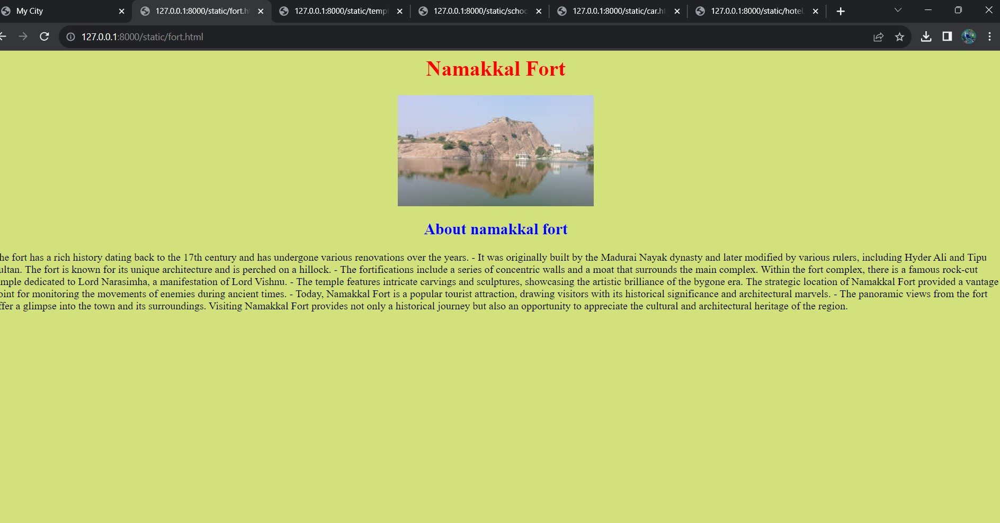
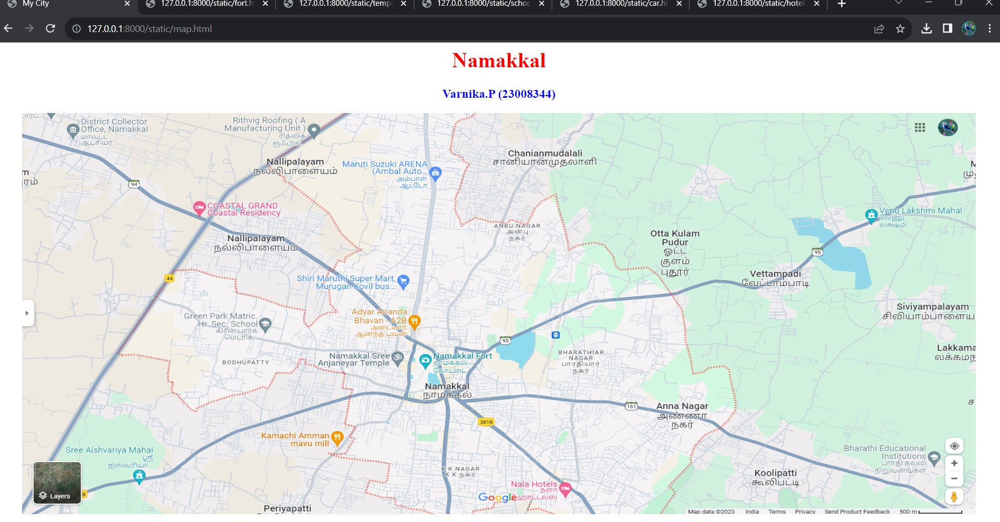
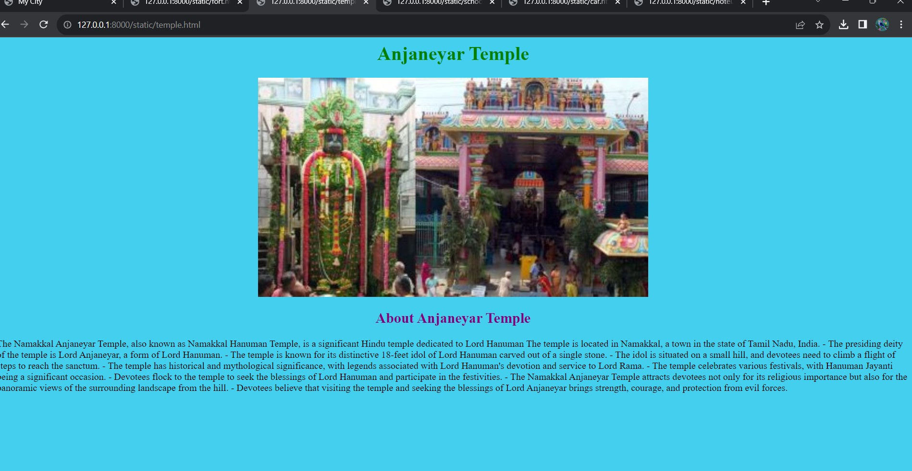
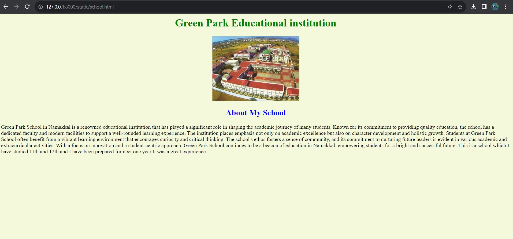
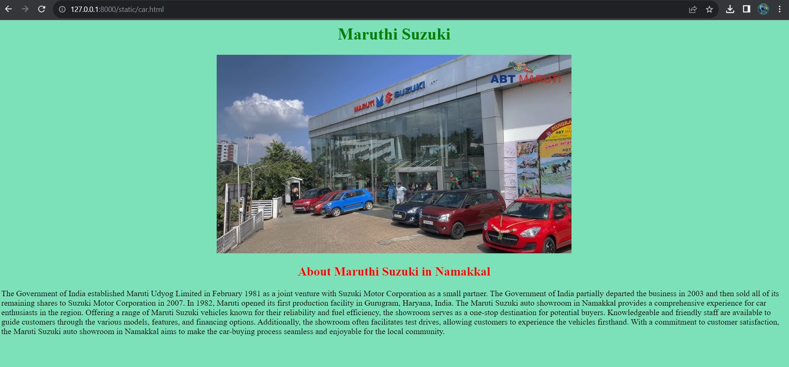
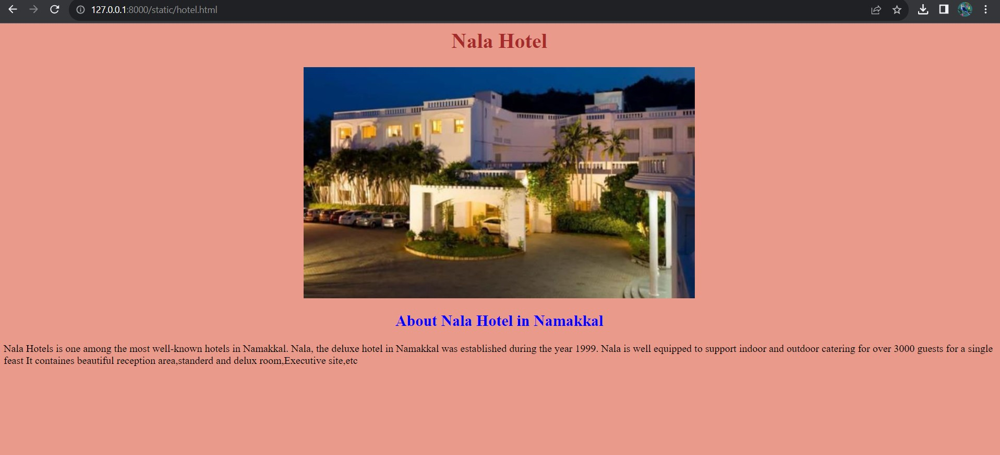

# Places Around Me
# Aim:
To develop a website to display details about the places around my house.

# Design Steps:
## Step 1:
 create a folder 'static' under the project folder 'mapapp'

## Step 2:
In 'static', create another folder 'html',under which the file map.html should be created.

## Step 3:
Go to the google map and take the screenshot of your home town on it and along with some places around it.

## step 4:
Go to images-maps.com and make five locations on it using the shapes used in maps.

## step 5:
Create a html code for the map and add it to 'map.html'.

## step 6:
Create a html documents to be displayed when click on the location map.

## step 7:
Take a screenshots of the output.

## step 8: 
Push it to 'README.md' and push it to the repositary

# Code:

## map.html
```
<html>
<head>
<title>My City</title>
</head>
<body>
<h1 align="center">
<font color="red"><b>Namakkal</b></font>
</h1>
<h3 align="center">
<font color="blue"><b>Varnika.P (23008344)</b></font>
</h3>
<center>


<map name= " My City">
<area shape="rect" coords="865,558,85" href="fort.html" title="namakkal fort">
<area shape="rect" coords="597,538,769,589" href="temple.html" title="anjaneyar temple">
<area shape="rect" coords="324,447,507,521" href="school.html" title="Greenpark">
<area shape="rect" coords="842,176,637,109" href="car.html" title="maruthi suzuki">
<area shape="rect" coords="980,841,1107,884" href="hotel.html" title="nala hotel">


</map>
</center>
</body>
</html>
```

## fort.html
```
<html>
    <head>
        <h1 align ="center"><font color="red" >Namakkal Fort</font></h1>
    </head>
    <body style="background-color:rgb(210, 225, 124);">
        
        
         <h4 align="center" ></h4>
        
        
        <h2 align="center"><font color="blue">About namakkal fort</font></h2>
        <p>
            The fort has a rich history dating back to the 17th century and has undergone various renovations over the years.
            - It was originally built by the Madurai Nayak dynasty and later modified by various rulers, including Hyder Ali and Tipu Sultan.
            The fort is known for its unique architecture and is perched on a hillock.
            - The fortifications include a series of concentric walls and a moat that surrounds the main complex.
            Within the fort complex, there is a famous rock-cut temple dedicated to Lord Narasimha, a manifestation of Lord Vishnu.
            - The temple features intricate carvings and sculptures, showcasing the artistic brilliance of the bygone era.
            The strategic location of Namakkal Fort provided a vantage point for monitoring the movements of enemies during ancient times.

            - Today, Namakkal Fort is a popular tourist attraction, drawing visitors with its historical significance and architectural marvels.
            - The panoramic views from the fort offer a glimpse into the town and its surroundings.

            Visiting Namakkal Fort provides not only a historical journey but also an opportunity to appreciate the cultural and architectural heritage of the region.

        </p>
    </body>
</html>
```

## temple.html


```
<html>
    <head>
        <h1 align ="center"><font color="green" >Anjaneyar Temple</font></h1>
    </head>
    <body style="background-color:rgb(69, 207, 238);">
        
         <h4 align="center"></h4>
        
        
        <h2 align="center"><font color="purple">About Anjaneyar Temple</font></h2>
        <p>
            The Namakkal Anjaneyar Temple, also known as Namakkal Hanuman Temple, is a significant Hindu temple dedicated to Lord Hanuman
            The temple is located in Namakkal, a town in the state of Tamil Nadu, India.


            - The presiding deity of the temple is Lord Anjaneyar, a form of Lord Hanuman.


            - The temple is known for its distinctive 18-feet idol of Lord Hanuman carved out of a single stone.
            - The idol is situated on a small hill, and devotees need to climb a flight of steps to reach the sanctum.


            - The temple has historical and mythological significance, with legends associated with Lord Hanuman's devotion and service to Lord Rama.


            - The temple celebrates various festivals, with Hanuman Jayanti being a significant occasion.
            - Devotees flock to the temple to seek the blessings of Lord Hanuman and participate in the festivities.


            - The Namakkal Anjaneyar Temple attracts devotees not only for its religious importance but also for the panoramic views of the surrounding landscape from the hill.


            - Devotees believe that visiting the temple and seeking the blessings of Lord Anjaneyar brings strength, courage, and protection from evil forces.

        </p>
        </body>
</html>
```

## school.html
```
<html>
    <head>
        <h1 align ="center"><font color="green" >Green Park Educational institution</font></h1>
    </head>
    <body style="background-color:rgb(244, 248, 219);">
        
         <h4 align="center"></h4>
        
        
        <h2 align="center"><font color="blue">About My School</font></h2>
        <p>
            Green Park School in Namakkal is a renowned educational institution that has played a significant role in shaping the academic journey of many students. Known for its commitment to providing quality education,
             the school has a dedicated faculty and modern facilities to support a well-rounded learning experience. 
             The institution places emphasis not only on academic excellence but also on character development and holistic growth. 
             Students at Green Park School often benefit from a vibrant learning environment that encourages curiosity and critical thinking.
              The school's ethos fosters a sense of community, and its commitment to nurturing future leaders is evident in various academic and extracurricular activities. With a focus on innovation and a student-centric approach,
               Green Park School continues to be a beacon of education in Namakkal, empowering students for a bright and successful future.
            This is a school which I have studied 11th and 12th and I have been prepared for neet one year.It was a great experience.
        </p>
    </body>
</html>
```

## car.html

```
<html>
    <head>
        <h1 align ="center"><font color="green" >Maruthi Suzuki</font></h1>
    </head>
    <body style="background-color:rgb(124, 225, 185);">
        
         <h4 align="center"></h4>
        
        
        <h2 align="center"><font color="red">About Maruthi Suzuki in Namakkal</font></h2>
        <p>
            The Government of India established Maruti Udyog Limited in February 1981 as a joint venture with Suzuki Motor Corporation as a small partner. 
            The Government of India partially departed the business in 2003 and then sold all of its remaining shares to Suzuki Motor Corporation in 2007.
             In 1982, Maruti opened its first production facility in Gurugram, Haryana, India.
             The Maruti Suzuki auto showroom in Namakkal provides a comprehensive experience for car enthusiasts in the region. 
             Offering a range of Maruti Suzuki vehicles known for their reliability and fuel efficiency, the showroom serves as a one-stop destination for potential buyers. 
             Knowledgeable and friendly staff are available to guide customers through the various models, features, and financing options. 
             Additionally, the showroom often facilitates test drives, allowing customers to experience the vehicles firsthand. 
             With a commitment to customer satisfaction, the Maruti Suzuki auto showroom in Namakkal aims to make the car-buying process seamless and enjoyable for the local community.
        </p>
    </body>
</html>
```

## hotel.html

```
<html>
    <head>
        <h1 align ="center"><font color="brown" >Nala Hotel</font></h1>
    </head>
    <body style="background-color:rgb(234, 154, 138);">
        
         <h4 align="center"></h4>
        
        
        <h2 align="center"><font color="blue">About Nala Hotel in Namakkal</font></h2>
        <p>
            Nala Hotels is one among the most well-known hotels in Namakkal.
             Nala, the deluxe hotel in Namakkal was established during the year 1999.
             Nala is well equipped to support indoor and outdoor catering for over 3000 guests for a single feast
             It containes beautiful reception area,standerd and delux room,Executive site,etc
        </p>
    </body>
</html>
```

# Output:







# Result:

The output was verified successfully